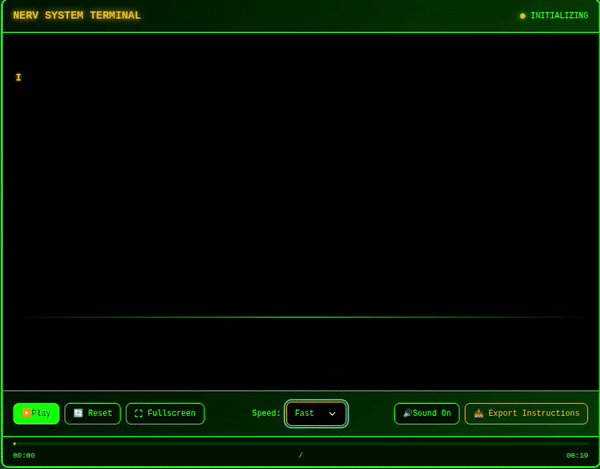

# 🚀 Third Impact Initiated... System Online

<div align="center">
  
[](https://git.io/typing-svg)


</div>

---

## 👨‍💻 Pilot Information

<p align="center">
  
</p>

<div align="center">

**[ `Developing systems that save humanity, one commit at a time` ]**

</div>

---

## 🤖 Eva Units (Tech Stack)

<div align="center">

### Core Systems

[](https://www.java.com/)
[](https://spring.io/projects/spring-boot)
[](https://www.postgresql.org/)
[](https://www.mysql.com/)

### Weapons Systems

[](https://developer.mozilla.org/en-US/docs/Web/JavaScript)
[](https://developer.mozilla.org/en-US/docs/Web/HTML)
[](https://developer.mozilla.org/en-US/docs/Web/CSS)

### Terminal Interface

[](https://git-scm.com/)
[](https://code.visualstudio.com/)
[](https://www.jetbrains.com/idea/)

</div>

---

## 🎯 NERV Projects

<div align="center">

### 🚨 **Priority Alpha Operations** 🚨

<a href="https://github.com/adil-jr/ProblemasJavaBeecrowd">
  
</a>

*📋 **MISSION BRIEF:** Pilot Training Protocol - Advanced problem-solving algorithms for combat scenarios*

<a href="https://github.com/adil-jr/rest-with-spring-boot-and-java">
  
</a>

*🧠 **MISSION BRIEF:** MAGI Supercomputer System - Core backend infrastructure powering NERV operations*

<a href="https://github.com/adil-jr/conversor-moedas-java">
  
</a>

*💰 **MISSION BRIEF:** NERV Resource Calculator - Financial systems for funding Eva operations*

<a href="https://github.com/adil-jr/dslist">
  
</a>

*👹 **MISSION BRIEF:** Angel Database System - Comprehensive catalog of Angel entities and combat data*

</div>

---

## 📊 Combat Stats

<div align="center">


### Activity Graph - Neural Interface Synchronization


</div>

---

## 🛰️ Contact Terminal

<div align="center">

```
┌─────────────────────────────────────────────────────────┐
│               NERV COMMUNICATION MATRIX                 │
├─────────────────────────────────────────────────────────┤
│  > Initiating quantum entanglement protocols...         │
│  > Establishing secured channels...                     │
│  > Connection stabilized                                │
└─────────────────────────────────────────────────────────┘
```

[](https://linkedin.com/in/adil-jr)
[](mailto:adil.jr@outlook.com)

</div>

---

<div align="center">

## 🎵 Current Mission Soundtrack

```
╔══════════════════════════════════════════════════════════════════════╗
║                          🎵 MAGI AUDIO SYSTEM 🎵                     ║
║──────────────────────────────────────────────────────────────────────║
║  ███╗   ██╗███████╗██████╗ ██╗   ██╗   [TERMINAL ATIVO]              ║
║  ████╗  ██║██╔════╝██╔══██╗██║   ██║   Status: ████████████ 100%     ║
║  ██╔██╗ ██║█████╗  ██████╔╝██║   ██║   Sync Ratio: MÁXIMO            ║
║  ██║╚██╗██║██╔══╝  ██╔══██╗╚██╗ ██╔╝                                 ║
║  ██║ ╚████║███████╗██║  ██║ ╚████╔╝    ♫ REPRODUZINDO AGORA ♫        ║
║  ╚═╝  ╚═══╝╚══════╝╚═╝  ╚═╝  ╚═══╝                                   ║
║                                                                      ║
║  🎼 TÍTULO: A Cruel Angel's Thesis (残酷な天使のテーゼ)                 ║
║  🎤 ARTISTA: Yoko Takahashi (高橋洋子)                                ║
║  💿 ÁLBUM: Neon Genesis Evangelion                                   ║
║  📅 ANO: 1995 | ⏱️ DURAÇÃO: 4:06                                     ║
║                                                                      ║
║  ▶️ PROGRESSO: ████████████████████████░░░░░░  [3:12/4:06]           ║
║                                                                      ║
║  📊 CONTROLES:                                                       ║
║  ├─ Volume: ████████████████░░░░ 80%                                 ║
║  ├─ Status: 🔊 ATIVO | 🎯 PADRÃO AZUL DETECTADO                      ║
║  └─ Link: https://open.spotify.com/intl-pt/track/3x4378z...          ║
║                                                                      ║
║  "Like a cruel angel's thesis, boys and girls will become legends..."║
╚══════════════════════════════════════════════════════════════════════╝
```

[](https://open.spotify.com/intl-pt/track/3x4378ztiLvFmm2nuzEI0C?si=b3692bc141114edc)

*"Like a cruel angel's thesis, boys and girls will become legends..."* 🎼

</div>


---

## 💡 System Status

<div align="center">

```
  ╔═══════════════════════════════════════════════════════╗
  ║                   NERV SYSTEM STATUS                  ║
  ╠═══════════════════════════════════════════════════════╣
  ║  ● Eva Unit 01: STANDBY                               ║
  ║  ● LCL Compatibility: 100%                            ║
  ║  ● AT Field Generator: ONLINE                         ║
  ║  ● Central Dogma Access: AUTHORIZED                   ║
  ║  ● Human Instrumentality Project: [CLASSIFIED]        ║
  ║                                                       ║
  ║  "You (mustn't) run away"                             ║
  ╚═══════════════════════════════════════════════════════╝
```

**"The fate of humanity rests in the hands of a child... and clean code."**

</div>

---

<div align="center">


*"The Eva is not just a machine... it's a manifestation of the pilot's soul"*

---


</div>